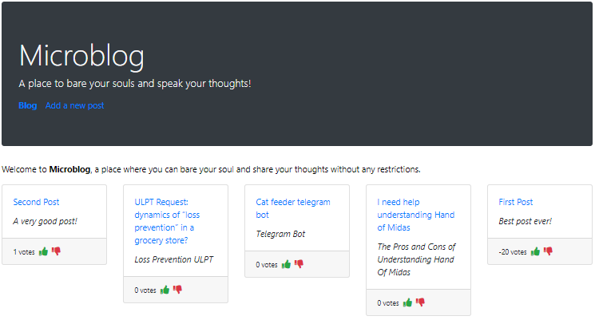

## Redux-Mircoblog

A blogging application implemented using express api's for the backend and React,Router and Redux for the Front End. With a PostgresSQL for the database.

## Todos
- [x] Loads the list of id/title/description from the server for all posts, and uses this to show the list on the homepage
- [x] When visiting a post, it retrieves the full detail of that post
- [x] adding/editing/deleting posts updates the backend
- [x] adding/deleting comments updates the backend
- [x] a post can be voted-up or voted-down. You should be able to do this on the homepage or the post-detail page
- [x] the homepage should show the posts most popular first and, of course, as you up/down-vote posts, this may need to re-arrange
- [ ] Keep in memory the post detail data for posts you’ve viewed, so you don’t reload it if you revisit the post detail page for a post.
- [ ] Categories for posts
- [ ] Multiple blogs, where each blog has many posts
- [ ] The ability to edit comments
- [ ] A page listing “most recent comments”
- [ ] Pagination for the homepage, so it shows batches of titles, rather than all
- [ ] Authentication and Authorization

